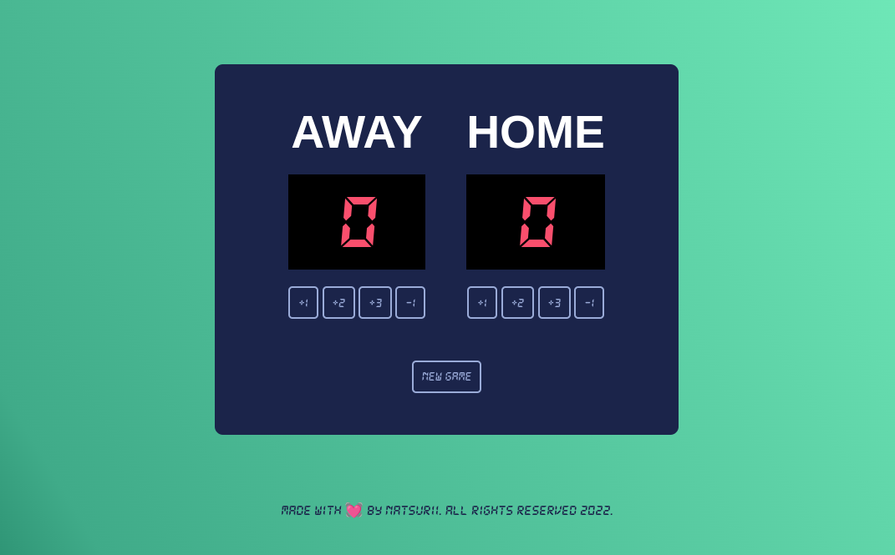

# Basketball Counter
A basic webapp for that serves as a scoreboard for a game. It uses vanilla HTML, CSS and Javascript.

This project is based on Scrimba's challenge.

[View the webapp](https://gregarious-biscochitos-7c4564.netlify.app/)